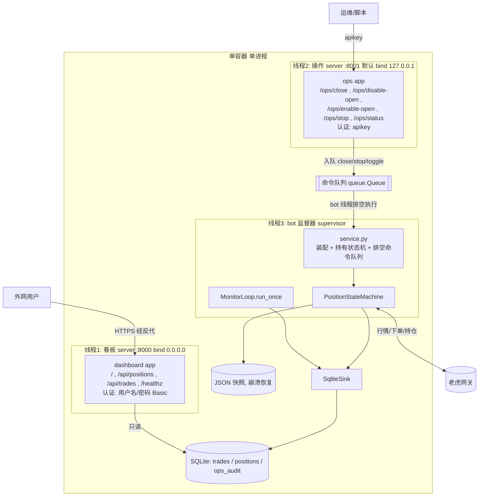

# 设计增量 — option_bot 只读看板 + SQLite 持久化 + Docker 单容器

**Date**: 2026-06-21
**Author**: Claude (nuclear-fusion / building-production-feature §2 设计)
**基线**: `option_bot/`（已实现的 CLI 期权交易程序）
**配套**: `docs/design/2026-06-21-us-option-trading-bot-solution.md`
**状态**: 待确认（**未写代码**）

> 用户已拍板：
> 1. **看板 UI** = 只读（展示持仓 + 交易记录），**需可被外网访问**，**用户名/密码登录**。
> 2. 部署 = **单容器单进程**（Flask 进程内后台线程跑 bot 盯盘 + 同进程提供看板）。
> 3. **操作命令面** = **单独端口**，**apikey 认证**，**默认仅本机、可配置开放外网**；能力 = **手动平仓 + 开关(kill switch)**，**不含远程开仓**。
>
> 即看板与操作命令是**两个独立网络面/两个端口**，认证方式与默认暴露范围不同（见 §6/§8）。本文只描述本增量。

---

## 1. Requirements（需求）

**一句话**：给 option_bot 加一个只读 Web 看板，展示当前持仓与历史交易记录，数据落 SQLite，用 Docker 一键起整套服务。

**In scope**：
- SQLite 持久化：交易事件（开/平仓）历史 + 当前持仓快照 + 操作审计。
- **只读看板（端口 A，外网可达，用户名/密码）**：持仓表 + 交易记录表，自动刷新。
- **操作命令面（端口 B，apikey，默认仅本机，可配置开放外网）**：手动平仓、kill switch（停/恢复开仓、停止盯盘）、状态查询。**无远程开仓**。
- 单容器单进程：看板 server + 操作 server + bot 盯盘线程同进程，共用同一 SQLite。
- 操作命令经**命令队列**交由 bot 线程执行（保证状态机单线程变更，见 §10）。
- Docker：Dockerfile + 单服务 docker-compose（`docker compose up` 一键起），暴露两个端口。

**Out of scope（不做）**：
- **从看板 UI 下单/平仓**（看板恒为只读；操作只走单独的操作命令面）。
- **远程开仓**（操作面也不提供开仓；开仓仅 CLI / 启动时 env 显式触发）。
- 多用户/角色/RBAC（单用户工具：看板=单组用户名密码，操作面=单 apikey）。
- 内置 TLS（明文 Basic/apikey；公网暴露建议前置 TLS 反向代理，见 §8/§11）。
- WebSocket 推送、JSON 快照迁库、行情图表（同前，均不做）。

**非功能目标**：
- 看板刷新延迟 ≤ 3s；操作命令生效延迟 ≤ 1 个盯盘 tick（命令入队后下个 tick 执行）。
- **看板进程不持有也不调用券商 SDK**（只读 SQLite）；**凭证只在 bot 线程**。
- 操作面即使 apikey 泄漏，**最坏只能平仓/停机（降风险），不能动用资金开仓**（爆炸半径受限）。
- 崩溃恢复语义不变（沿用 JSON 快照 + 远端持仓为准）。

**成功判据**：
1. `docker compose up` 后，外网可访问看板（需登录），能看到持仓/交易两张表并自动刷新。
2. 对操作端口带正确 apikey `POST /ops/close` 能在 1 个 tick 内触发平仓；带错误/缺失 apikey 返回 401。
3. 默认配置下操作端口仅 `127.0.0.1` 可达；置 `OBOT_OPS_EXPOSE=true` 后才外网可达。
4. 看板进程无 API 私钥也能渲染。

## 2. Reference Landscape（参考）

| 参考 | 借鉴 | 不适用 |
|---|---|---|
| **Freqtrade `FreqUI` + SQLAlchemy/SQLite trades 表** | trades 表 + 当前持仓视图的数据模型；只读监控面板的形态 | 它用 FastAPI + REST + 前端 SPA + SQLAlchemy，过重；我们用 stdlib `sqlite3` + Flask + 单模板 |
| **Flask「app + 后台线程」模式（Flask docs / `threading`）** | 单进程内 web 前台 + daemon 线程跑长任务；`threaded=True` 同时服务多请求 | 多 worker（gunicorn -w>1）会重复起 bot 线程——本设计限定单 worker |
| **SQLite WAL 并发模型** | 单写多读（bot 写、web/前端读）在 WAL 下安全 | 高并发写不适用；我们单写者足够 |

## 3. Implementation Architecture（架构）

**风格**：单进程、分层。在已有 option_bot 分层上**新增两层**：persistence（SQLite 仓储 + 事件 sink）与 web（Flask 看板）。bot 逻辑层通过一个 **EventSink 抽象**写持久化，**零侵入**（默认 NullSink，CLI 既有行为与测试不变）。

单进程内 **3 个线程** + 共享 SQLite + 共享一个**命令队列**：



**关键组件（新增）**：
| 组件 | 路径 | 职责 |
|---|---|---|
| SQLite 仓储 | `option_bot/persistence/db.py` | 建表(WAL)、`insert_trade`/`upsert_position`/`delete_position`/`insert_ops_audit`/`list_*` |
| 事件 sink | `option_bot/persistence/sink.py` | `EventSink`+`NullSink`+`SqliteSink`：`on_open/on_close/on_position/on_position_closed` |
| 命令面板 | `option_bot/service.py` | `CommandQueue`(线程安全) + `Supervisor`：装配、起 bot 线程、每 tick 排空命令、可选 `OPEN_ON_START` |
| 看板应用 | `option_bot/web/dashboard.py` | 只读路由 + Basic 认证；只读 SQLite |
| 操作应用 | `option_bot/web/ops.py` | 操作路由 + apikey 认证；只入队命令(不直接动状态机) |
| 认证工具 | `option_bot/web/auth.py` | Basic 校验 + apikey 常量时间比较 |
| 入口 | `option_bot/web/server.py` | 起 3 线程（dashboard/ops/supervisor），按 env 决定 ops 绑定地址 |
| 模板 | `option_bot/web/templates/dashboard.html` | 持仓表 + 交易表 + 轮询刷新 |
| Docker | `Dockerfile`、`docker-compose.yml`、`.dockerignore` | 构建与一键起，暴露 8000/8001 |
| 依赖 | `option_bot/requirements.txt` | `flask`（唯一新增运行时依赖） |

> 小重构：`MonitorLoop` 抽出 `run_once()`（`run()` 改为 `while ...: run_once()`，行为不变），供 supervisor 在「排空命令 + 单 tick」的外层循环中复用。

**技术选型**（呼应 §2，遵循「不复杂」）：
- 持久化：stdlib **`sqlite3`**（零新增依赖、单文件、WAL 足够）——不引 SQLAlchemy/ORM。
- Web：**Flask**（同步、轻、与同步 SDK 契合；新增唯一依赖）——不引 FastAPI/前端框架。
- 刷新：**前端 JS `fetch` 轮询**（每 3s）——不引 WebSocket。
- 服务器：Flask 内置 `threaded=True` 单进程（生产可换 `gunicorn -w 1 --threads N`，单 worker 以免重复起 bot 线程）。

## 4. Module Layering（分层）

在既有四层上加两层，依赖单向向下：

| Layer | 目录 | 依赖 | 不可依赖 |
|---|---|---|---|
| Web（新） | `option_bot/web/` | service、persistence(只读) | adapters/strategy 直接调用、SDK |
| Service（新，装配） | `option_bot/service.py` | config、adapters、strategy、persistence | web |
| Strategy | `option_bot/strategy/` | adapters、domain、**persistence.sink(抽象)** | web、service |
| Persistence（新） | `option_bot/persistence/` | domain | strategy、adapters、web |
| Adapters / Domain / Config | （既有） | — | — |

**零侵入原则**：strategy 只认 `EventSink` 抽象（构造参数，默认 `NullSink`）。不引入对 sqlite 的直接依赖；web 不 import strategy 的下单路径。

## 5. 数据模型（SQLite Schema）

`sqlite3`，启动建表，WAL 模式。两张表：

```sql
-- 交易记录（开/平仓事件，append-only 历史）
CREATE TABLE IF NOT EXISTS trades (
    id          INTEGER PRIMARY KEY AUTOINCREMENT,
    ts          INTEGER NOT NULL,         -- 毫秒时间戳
    account     TEXT    NOT NULL,
    identifier  TEXT    NOT NULL,         -- 期权标识 e.g. 'AAPL  250815C00200000'
    symbol      TEXT    NOT NULL,
    direction   TEXT    NOT NULL,         -- LONG / SHORT
    action      TEXT    NOT NULL,         -- OPEN / CLOSE
    qty         REAL    NOT NULL,
    price       REAL,                     -- avg_fill_price
    reason      TEXT,                     -- OPEN / TAKE_PROFIT / STOP_LOSS / TIME_FORCE_CLOSE / MANUAL
    order_id    INTEGER,
    pnl_percent REAL                      -- CLOSE 时记录平仓时盈亏%
);
CREATE INDEX IF NOT EXISTS idx_trades_ts ON trades(ts);

-- 当前持仓快照（监控循环每 tick upsert；平仓后删除）
CREATE TABLE IF NOT EXISTS positions (
    identifier   TEXT PRIMARY KEY,
    account      TEXT NOT NULL,
    symbol       TEXT NOT NULL,
    direction    TEXT NOT NULL,
    qty          REAL,
    entry_price  REAL,
    market_price REAL,
    unrealized_pnl         REAL,
    unrealized_pnl_percent REAL,          -- 百分数(30.0=+30%)
    state        TEXT,                     -- MONITORING / CLOSING
    updated_ts   INTEGER
);

-- 操作命令审计（操作面每次命令落一条）
CREATE TABLE IF NOT EXISTS ops_audit (
    id        INTEGER PRIMARY KEY AUTOINCREMENT,
    ts        INTEGER NOT NULL,
    action    TEXT    NOT NULL,            -- close / disable_open / enable_open / stop
    source_ip TEXT,
    key_id    TEXT,                        -- apikey 的可记录标识(前若干位/别名，不存全量)
    result    TEXT                         -- queued / rejected
);
```

- **一致性**：positions = 当前态（单持仓模型下 0~1 行）；trades = 不可变历史。真相源仍是券商侧；SQLite 是展示/审计副本。
- **写入点**（hook，全部经 sink）：
  - `state_machine.open()` 成交后（`state_machine.py:74-77`）→ `sink.on_open(...)` → `insert_trade(OPEN)` + `upsert_position`。
  - `monitor_loop._tick()` 取到 pnl 后（`monitor_loop.py:43`）→ `sink.on_position(view)` → `upsert_position`。
  - `state_machine.close()` 成交后（`state_machine.py:131-132`）→ `sink.on_close(reason,pnl)` → `insert_trade(CLOSE)` + `delete_position`。
- **保留/清理**：trades 永久保留（可选 `--purge-before` 清理旧记录，本期不做）。positions 平仓即删。
- **并发**：WAL；bot 单写者，web/前端只读。sqlite3 连接每线程独立（web 请求与 bot 线程各自连接），`check_same_thread` 默认安全。

## 6. 接口与协议（Web 路由）

两个 HTTP server、两个端口、两套认证。

**看板 server（端口 8000，bind 0.0.0.0，认证=用户名/密码 Basic，只读）**：
| 路由 | 方法 | 返回 | 说明 |
|---|---|---|---|
| `/` | GET | HTML | 看板页（含轮询 JS） |
| `/api/positions` | GET | JSON list | 当前持仓快照（含 unrealized_pnl_percent、state） |
| `/api/trades?limit=100` | GET | JSON list | 最近交易记录（按 ts 倒序） |
| `/healthz` | GET | `{"status":"ok","bot_alive":bool}` | 健康检查（**免认证**，供探针） |

**操作 server（端口 8001，默认 bind 127.0.0.1，认证=apikey，写=入队）**：
| 路由 | 方法 | 行为 | 返回 |
|---|---|---|---|
| `/ops/status` | GET | 读 bot 状态/enable_open/队列深度 | 200 JSON |
| `/ops/close` | POST | 入队「手动平仓」(reason=MANUAL) | 202 `{"queued":"close"}` |
| `/ops/disable-open` | POST | 入队「停开仓」(kill switch) | 202 |
| `/ops/enable-open` | POST | 入队「恢复开仓」 | 202 |
| `/ops/stop` | POST | 入队「停止盯盘」(should_stop) | 202 |

- **认证**：
  - 看板：HTTP Basic，凭证 = env `OBOT_WEB_USER`/`OBOT_WEB_PASSWORD`；未配置则**拒绝启动看板**（避免无密码裸奔公网）。
  - 操作：请求头 `X-API-Key`（或 `Authorization: Bearer`），与 env `OBOT_OPS_API_KEY` **常量时间比较**；未配置 `OBOT_OPS_API_KEY` 则**不启动操作 server**（默认关）。
- **错误模型**：401 未认证 `{"error":"unauthorized"}`；DB 不可用 500；空数据 200 `[]`；操作入队成功 202（**异步**，实际生效在下个 tick）。
- **写=入队而非直接调用**：操作路由只把命令放进 `CommandQueue`，由 bot 线程排空执行——确保状态机只被一个线程变更（§10 并发）。
- **看板 UI（草图）**：

```
┌────────────────────────────────────────────┐
│  option_bot 看板        ● bot: alive  ⟳3s   │
├── 当前持仓 ────────────────────────────────┤
│ 标识            方向  数量 入场  现价  盈亏%  状态 │
│ AAPL 250815C200 LONG  1   8.05  9.20 +14.3% 监控 │
├── 交易记录 ────────────────────────────────┤
│ 时间      动作  标识            数量 价格  原因      │
│ 12:31:05 CLOSE AAPL...C200      1   9.50 TAKE_PROFIT│
│ 12:05:11 OPEN  AAPL...C200      1   8.05 OPEN       │
└────────────────────────────────────────────┘
```

## 7. 数据处理与存储

- 见 §5。无迁移工具（建表即用）。
- **备份恢复**：SQLite 单文件挂在 Docker 卷；丢失只损失展示历史，不影响交易安全（真相在券商侧 + JSON 快照）。

## 8. 权限控制（两面分治）

| 维度 | 看板 server | 操作 server |
|---|---|---|
| 端口 | 8000 | 8001 |
| 默认绑定 | `0.0.0.0`（外网可达，用户要求） | `127.0.0.1`（仅本机）；`OBOT_OPS_EXPOSE=true` → `0.0.0.0` |
| 认证 | 用户名/密码（HTTP Basic，env 必填，否则不启动） | apikey（`X-API-Key`，常量时间比较，env 未配则不启动） |
| 能力 | 只读 | 平仓 + 开关（**无开仓**） |
| 凭证暴露 | **不持有 API 私钥** | 不持有私钥（只入队；真正下单在 bot 线程） |

- **API 私钥/token 只在 bot 线程**经 SDK 加载（沿用既有 §8），两个 web server 都不读凭证。
- **常量时间比较**：apikey 用 `hmac.compare_digest`，防计时侧信道。
- **最小权限/爆炸半径**：操作面能力刻意限定为「平仓 + 停机」，apikey 即使泄漏也**无法远程开仓动用资金**（用户已选）。
- **TLS（重要）**：Basic 与 apikey 均为明文凭证。公网暴露 8000/8001 **必须前置 TLS 反向代理**（nginx/caddy/Cloudflare Tunnel）；Flask 自带 server 仅供个人/内网，生产前置反代 + `gunicorn`。写入 runbook 强约束。
- **审计**：所有操作命令落 `ops_audit` 表（who=apikey 标记 / what=动作 / when=ts / 来源 IP / 结果）。

## 9. 监控/审计

- **审计**：trades 表即交易审计（who=account / what=action+identifier / when=ts / outcome=price+reason）。沿用既有 `trades_audit.log`（设计 §9）双写。
- **健康**：`/healthz` 暴露 bot 线程存活；后台线程异常退出 → `bot_alive=false`，看板顶部红点提示。
- **日志**：沿用 stdlib logging；token 脱敏不变。

## 10. 风险防控（本增量特有）

- **并发：状态机只被 bot 线程变更（关键）**。操作 server 收到 close/stop/toggle 后**只入队**(`CommandQueue.put`)，由 bot 线程在每个 tick 排空执行。看板 server 全程只读 SQLite。因此 `PositionStateMachine.open/close` 仍是单线程调用——既有「平仓幂等靠单线程 + 查 salable_qty」的正确性不变，无需新增锁。命令入队到执行的窗口 ≤ 1 个 poll 间隔。
- **后台线程与 web 同生命周期**：bot 线程设 daemon；线程内异常 try/except 包裹 + 日志 + 置 `bot_alive=false`，**不拖垮看板**；`/healthz` 暴露存活，前端红点提示。
- **两端口一进程**：看板/操作各自 `app.run` 跑在独立 daemon 线程，`threaded=True`、`use_reloader=False`（避免重复起线程）。生产：前置反代 + 各自 `gunicorn -w 1`。
- **SQLite 写争用**：单写者(bot) + WAL；两 web server 只读。每线程独立连接、`check_same_thread` 安全。
- **操作面爆炸半径**：能力限定平仓+停机，**无开仓**；apikey 泄漏的最坏后果是「被强制平仓/停盯盘」（降风险方向），不会被远程开真实仓位。
- **容器内自动开仓风险**：默认 `OPEN_ON_START=false`，容器起来只盯盘/恢复，**不自动下单**；开仓需显式 env 或 `docker exec` 跑 CLI。沿用既有 R1–R5 全部风控。
- **DoS（公网看板）**：看板暴露公网有被刷风险；前置反代做限流/TLS；`/api/*` 查询轻、只读 SQLite，影响有限。
- **回滚**：除既有文件加「可选 sink 参数(默认 NullSink)」+ `MonitorLoop.run_once` 抽取外，全为新增文件；回滚 = 删新增 + 还原这两处，既有 CLI 行为零变化。

## 11. Open Questions（待定，给默认）

1. **端口**：看板 `8000`（默认 bind `0.0.0.0`，外网可达）；操作 `8001`（默认 bind `127.0.0.1`，`OBOT_OPS_EXPOSE=true` 才外网）。如冲突可改 env。
2. **TLS**：本期不内置 TLS，明文 Basic/apikey。**强烈建议**公网前置 caddy/nginx/Cloudflare Tunnel 做 TLS+限流（runbook 给 caddy 示例）。是否要我在 compose 里直接加一个可选 caddy 服务？默认不加（保持单容器）。
3. **bot 在容器内是否自动开仓**：默认**否**（只盯盘/恢复）。开仓走 CLI/env 显式触发。
4. **基础镜像**：`python:3.11-slim`（SDK 要求 ≥3.8，选 3.11 稳定）。
5. **历史保留**：trades/ops_audit 永久保留，暂不加清理。

## 12. Alternatives Considered

- **进程模型**：单容器单进程(选, 用户定) vs compose 双服务(bot/web 分离)。单进程零件少；代价是 web 与交易同进程（已用只读+sink 抽象隔离）。
- **持久化**：stdlib sqlite3(选) vs SQLAlchemy vs TinyDB/JSON。选 sqlite3：零依赖、SQL 查询力够、WAL 并发安全。
- **Web 框架**：Flask(选) vs FastAPI vs 纯 `http.server`。Flask：模板+路由开箱、生态熟、足够轻；http.server 太裸，FastAPI 偏重。
- **刷新**：JS 轮询(选) vs WebSocket vs meta-refresh。轮询最简且够用；meta-refresh 整页闪烁体验差。

## 13. Implementation Plan（确认后执行）

1. `persistence/db.py`：`SqliteRepo`（建表/WAL、insert_trade、upsert_position、delete_position、insert_ops_audit、list_*）。
2. `persistence/sink.py`：`EventSink`/`NullSink`/`SqliteSink`。
3. 改 `strategy/state_machine.py`：构造加 `sink=NullSink()`；open/close 成交后调用 sink（**仅加调用，不改交易逻辑**）。
4. 改 `strategy/monitor_loop.py`：抽出 `run_once()`（`run()` 行为不变）；构造加 `sink`；tick 取到 view 后 `sink.on_position`。
5. 改 `cli/main.py`：`run` 可选 `--db-file` → 注入 `SqliteSink`（CLI 跑也落库）。
6. `service.py`：`CommandQueue` + `Supervisor`（装配 + 起 bot 线程 + 每 tick 排空命令 + `OPEN_ON_START` 可选 + 处理 close/disable_open/enable_open/stop）。
7. `web/auth.py`：Basic 校验 + apikey 常量时间比较。
8. `web/dashboard.py`（只读 + Basic）、`web/ops.py`（apikey + 入队 + ops_audit）、`web/templates/dashboard.html`。
9. `web/server.py`：起 3 线程（dashboard 0.0.0.0:8000 / ops 按 `OBOT_OPS_EXPOSE` 绑定:8001 / supervisor）；env 缺 Basic 凭证→不起看板，缺 apikey→不起操作面。
10. `Dockerfile` + `docker-compose.yml`(暴露 8000/8001、卷、env_file) + `.dockerignore` + `option_bot/requirements.txt`(flask)。
11. 测试：`persistence`（CRUD/临时 db）；`sink`（写库断言）；`web`（Flask test_client：看板 Basic 401/200、ops apikey 401/202、`/ops/close` 入队断言、`/healthz`）；`service`（命令排空：close→sm.close(MANUAL)、stop→should_stop、toggle→enable_open）；state_machine 既有测试补「sink 被调用」断言。
12. Runbook 增补：flask 依赖、docker build/up、双端口、卷、env（凭证/Basic/apikey/OPS_EXPOSE/OPEN_ON_START）、**TLS 反代 caddy 示例**、回滚。

**本地不执行 build/test**（硬约束）；产出 runbook 供验证者在 Docker 跑。

---

## 确认点

请确认以下默认是否 OK，确认后我按 §13 实现：
- 只读看板（无下单入口）✅ 已定；**操作命令面 = 平仓 + 开关，无远程开仓** ✅ 已定
- 单容器单进程、3 线程（看板 / 操作 / bot），操作经**命令队列**交 bot 线程执行 ✅
- 看板 `0.0.0.0:8000` + **用户名/密码**（env 必填，否则不启动）
- 操作面 `:8001`，**apikey** 认证（env 未配则不启动），**默认仅本机**，`OBOT_OPS_EXPOSE=true` 才外网
- 容器默认**不自动开仓**（只盯盘/恢复）
- stdlib sqlite3 + Flask；保留既有 JSON 崩溃快照不动
- **TLS 不内置**：公网暴露请前置反代（runbook 给 caddy 示例）。是否要我在 compose 里直接附一个**可选 caddy(TLS) 服务**？默认不加 ← 这点请明确
