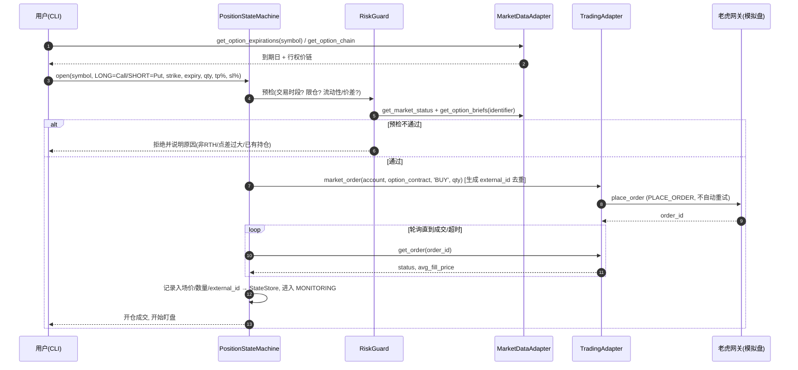
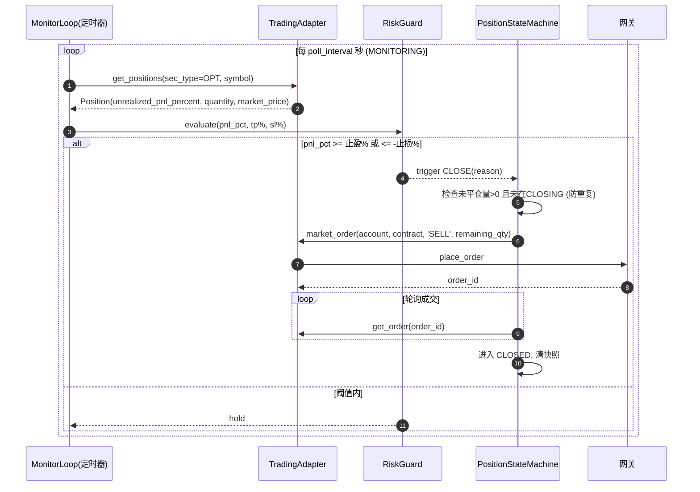
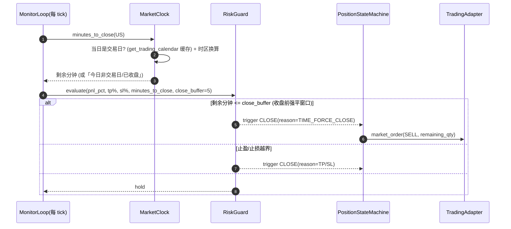

# 方案设计 — 美股期权自动交易程序（基于 tigeropen SDK）

**Date**: 2026-06-21
**Author**: Claude (nuclear-fusion / designing-solution)
**Repo**: `openapi-python-sdk`（tigeropen v3.5.9）
**Status**: 待用户评审（设计阶段，未写任何源码）

> 已确认的需求口径（用户拍板）：
> 1. **做多 = 买入 Call，做空 = 买入 Put**，两者都是 **BUY-to-open**（风险有限，无需裸卖期权权限）；平仓 = **SELL-to-close**。
> 2. 首期跑在 **模拟盘（paper account）**。
> 3. 收益/亏损阈值按 **持仓未实现盈亏百分比（`unrealized_pnl_percent`）** 计算。

---

## 0. 可行性确认（先回答「能不能做」）

逐项对照 SDK 源码，**全部能力均已存在**，方案可行：

| 需求 | SDK 能力 | 证据 `file:line` | 结论 |
|---|---|---|---|
| 查看美股某标的的期权 | `get_option_expirations` → `get_option_chain` → `get_option_briefs` | `quote/quote_client.py:924, 963, 1050` | ✅ 可列到期日→链→实时行情(DataFrame) |
| 构造期权合约 | `option_contract_by_symbol` / `option_contract(identifier)` | `common/util/contract_utils.py:19, 25` | ✅ |
| 市价单下单（开仓） | `market_order(account, contract, 'BUY', qty)` → `place_order` | `common/util/order_utils.py:12`；`trade/trade_client.py:919` | ✅ MKT 订单 |
| 实时刷新价格 | 轮询 `get_option_briefs`（含 latest/mid/bid/ask）或推送 `subscribe_option` | `quote_client.py:1050`；`push/protobuf_push_client.py:328` | ✅ 两条路都通 |
| 计算未实现盈亏% | `get_positions(sec_type=OPT)` 直接返回 `unrealized_pnl_percent`/`market_price` | `trade/trade_client.py:259`；`trade/domain/position.py:32-35` | ✅ SDK 已算好 |
| 自动平仓（卖出） | 反向 `market_order(..., 'SELL', qty)` → `place_order` | `order_utils.py:12`；`trade_client.py:919` | ✅ |
| 确认成交价/状态 | `get_order` 返回 `avg_fill_price` / `status` | `trade/domain/order.py:80` | ✅ |
| 判断是否在交易时段 | `get_market_status`（返回 `trading_status` + 下次 `open_time`） | `quote_client.py:139,152` | ✅ |
| 判断是否交易日（过滤节假日） | `get_trading_calendar`（返回 `date` + `TRADING/NON_TRADING`） | `quote_client.py:2736,2749` | ✅ |
| **拿到「收盘时间」做收盘前N分钟强平** | ⚠️ **SDK 不直接给收盘时间**：`get_market_status` 只给下次开盘、`get_trading_calendar` 只给日期类型、无盘中时段/半日市标记 | `quote_client.py:152,2749-2762` | ⚠️ 需本地推算（见 R5） |

**但有 5 个必须在设计里正面处理的约束（否则会亏钱/误触发）**，已分别落到 §10 风控：

- **R1 市价单滑点**：期权流动性差时 MKT 单成交价可能远离盘口；SDK 把 `PLACE_ORDER` 列入 `SKIP_RETRY_SERVICES`（`tiger_open_client.py:30`），下单失败**不自动重试**，需自管重试与去重。
- **R2 监控中断 = 持仓失管**：SDK 是同步阻塞、单机进程，轮询循环一旦崩溃/断网，已开仓位无人盯盘。需要本地看门狗 + 券商侧硬止损兜底。
- **R3 阈值口径依赖远端字段**：`unrealized_pnl_percent` 由服务端计算，开仓后到持仓出现有数秒延迟，期间用行情兜底。
- **R4 交易时段**：美股期权仅 RTH 交易，阈值在盘后触发也无法立即平仓。
- **R5 收盘时间需本地推算**（新增）：NASDAQ/NYSE 常规收盘均为 **16:00 美东(America/New_York)**，但 SDK 不提供该时刻，需本地用时区计算 + 交易日历过滤非交易日；**半日市(13:00 ET 提前收盘) SDK 无标记**，需可配置兜底。

---

## 1. Problem Statement（问题定义）

**一句话目标**：一个本地运行的命令行程序，让用户对某美股标的「选一个期权 → 选方向(做多买Call/做空买Put) → 市价开仓 → 实时盯盈亏% → 达到止盈或止损阈值后自动市价平仓」。

**In scope**：
- 美股期权链查看与单腿期权选择。
- 单腿、BUY-to-open 开仓（做多 Call / 做空 Put）。
- 市价单下单 + 成交确认。
- 实时盈亏%监控（轮询为主）。
- 止盈/止损阈值触发的自动 SELL-to-close 平仓。
- **收盘前 N 分钟（默认 5，可配置）时间强平**：临近 NASDAQ/NYSE 收盘强制 SELL-to-close，无条件优先于盈亏阈值。
- 模拟盘运行；CLI 交互；本地日志。

**Out of scope（首期不做）**：
- 卖出开仓/裸写期权、多腿/价差/组合单（`combo_order` 暂不用）。
- 港股/期货期权、多标的并发组合管理（首期单标的单持仓）。
- 持久化数据库、Web UI、多用户、回测引擎。
- 复杂算法单（TWAP/VWAP）、移动止损（首期固定阈值）。

**非功能目标**：
- 监控时延：阈值评估周期 **≤ 3s**（轮询间隔可配，默认 2s）。
- 下单时延：SDK 请求超时沿用默认 15s（`tiger_open_config.py:63`）。
- 可靠性：进程异常退出后，**不得**留下「已开仓但无止损保护」的裸仓（靠 R2 兜底）。
- 安全：私钥/token 不落明文日志，配置复用 SDK 的三级加载。

**显式约束**：
- 复用现有 `tigeropen` SDK（同步、单进程），不引入异步框架。
- Python ≥ 3.8。
- 程序作为 SDK 的**外部使用方**存在，**不修改 SDK 源码**（新增独立包/脚本）。

**成功判据（可度量）**：
1. 模拟盘下，能完整跑通「开仓成交 → 盈亏%上穿止盈阈值 → 自动平仓成交」与「→ 下穿止损阈值 → 自动平仓成交」两条链路。
2. 任一环节失败（下单被拒/断网/无持仓）有明确日志与安全停机，不重复下单。
3. 同一持仓的平仓指令**至多发出一次**（幂等，靠状态机 + 持仓数量校验）。

## 2. Reference Landscape（参考实现）

| 参考 | 链接 | 可比之处 / 借鉴 | 不适用之处 |
|---|---|---|---|
| **Freqtrade** | github.com/freqtrade/freqtrade | 配置驱动的交易机器人；**持仓生命周期状态机**、`stoploss`/`take_profit` 阈值、`max_open_trades` 限仓、dry-run（模拟）开关——直接借鉴其「策略层与交易所适配层分离 + 一个 trade 一条状态机」 | 面向加密现货/合约、内置交易所 ccxt 适配；我们用 tigeropen，无需其撮合/回测引擎 |
| **IBKR `ib_insync` bracket order 模式** | ib-insync 文档 / IBKR bracket order | 期权/股票的 **bracket（母单+止盈+止损）** 与 OCO 思路；券商侧挂止损单作为「本地看门狗失效」的兜底——借鉴到 R2 | tigeropen 单腿期权的券商侧 STP 支持需确认；ib API 异步事件模型与本同步轮询不同 |
| **本 SDK 自身的可靠性约定** | `tiger_open_client.py:30,163-173` | `SKIP_RETRY_SERVICES` 把下单排除自动重试、fibonacci 退避——直接沿用其「下单不自动重试，由上层去重」的纪律 | 它只到「单次请求」层；持仓级状态机/阈值需我们自建 |

**总览借鉴结论**：采用 Freqtrade 式「**适配层(行情/交易) + 策略状态机 + 风控**」三段分层，单 trade 单状态机；阈值与限仓配置化；模拟盘=dry-run 的等价物；券商侧止损单作为本地监控的兜底（bracket 思路）。

## 3. Implementation Architecture（实现架构）

**架构风格**：**单进程、同步轮询的分层 CLI 应用**。理由：SDK 本身同步阻塞、单机（§分析报告 §7.1），引入 asyncio 只会增加阻抗失配；单标的单持仓的盯盘是「定时轮询 + 状态机」的典型形态，无需消息队列/多服务。

**部署拓扑**：单个 Python 进程，前台 CLI 运行（或 `nohup`/`tmux`/systemd 守护）。无外部存储依赖；状态在内存 + 一个本地 JSON 状态快照文件（崩溃恢复用，见 §7）。

**关键组件**：

| 组件 | 职责 | 输入 | 输出 |
|---|---|---|---|
| `ConfigLoader` | 复用 `get_client_config` 装载 tiger_id/account/私钥；加载策略参数（阈值/轮询间隔/限仓） | props/env/CLI | `TigerOpenClientConfig` + `StrategyConfig` |
| `MarketDataAdapter` | 封装 `QuoteClient`：列期权链、查实时期权行情、查市场状态 | symbol/expiry/identifier | DataFrame / dict |
| `TradingAdapter` | 封装 `TradeClient`：市价开仓/平仓、查订单成交、查持仓盈亏% | Order/account | order_id / Position |
| `PositionStateMachine` | 单持仓生命周期状态机（核心）：SELECTING→OPENING→OPEN→CLOSING→CLOSED | 事件/轮询 tick | 状态迁移 + 下单指令 |
| `RiskGuard` | 阈值评估、限仓、交易时段校验、**收盘前N分钟时间强平判定**、滑点/流动性预检、kill switch | Position/Quote/时钟 | 平仓/拒单/告警决策 |
| `MarketClock` | 推算当日 NASDAQ/NYSE 收盘时刻（16:00 ET，半日市可配）、过滤非交易日、算「距收盘剩余分钟」 | `get_trading_calendar` + 本地时区/半日市配置 | 收盘时刻 / 剩余分钟 |
| `MonitorLoop` | 主循环：定时拉持仓盈亏%→喂给 RiskGuard→驱动状态机 | timer | 触发平仓 |
| `CliApp` | Click 交互：选标的/期权/方向/数量/阈值，启动/停止 | 用户输入 | 调用上述组件 |
| `StateStore` | 本地 JSON 快照（当前持仓 + 状态 + 入场价 + external_id），崩溃恢复 | 状态机事件 | 文件 |

**依赖图**（单向，无环）：

```
CliApp ──▶ PositionStateMachine ──▶ TradingAdapter ──▶ TradeClient(SDK)
   │              │  ▲                     │
   │              ▼  │                     └──▶ (order/position)
   │         RiskGuard ◀── MonitorLoop ──▶ MarketDataAdapter ──▶ QuoteClient(SDK)
   │              │                              │
   └──────────────┴── ConfigLoader ── StateStore │
                                                 └──▶ get_market_status
```

**技术选型**（每项引用 §2 或现有栈）：
- 语言/运行时：Python 3.8+（沿用 SDK 约束）。
- CLI：复用 SDK 已依赖的 `click`（§分析报告 §2.3），与 `tigeropen/cli` 风格一致。
- 行情/交易：`tigeropen.QuoteClient` / `TradeClient`（既有，借鉴 §2 本 SDK 约定）。
- 实时机制：**轮询优先**（`get_option_briefs` + `get_positions`），推送 `subscribe_option` 作为可选增强（理由见 §6）。
- 状态/配置：本地 `.properties`（复用 SDK 配置）+ 策略用 JSON/CLI 参数；崩溃快照用 JSON 文件。
- 无新增重依赖（不引入 DB/MQ/asyncio）。

## 4. Module Layering（模块分层）

**分层模型**：经典分层（Presentation → Application/Strategy → Adapter → SDK/Infra），对应 Freqtrade 的「策略/交易所适配分离」。

| Layer | 目录 | 职责 | MAY depend on | MAY NOT depend on |
|---|---|---|---|---|
| Presentation | `option_bot/cli/` | Click 命令、交互选择、输出渲染 | Application | SDK 内部、Adapter 细节 |
| Application/Strategy | `option_bot/strategy/` | 状态机、风控、监控循环 | Adapter、domain | CliApp、SDK 直接调用 |
| Adapter | `option_bot/adapters/` | `MarketDataAdapter`/`TradingAdapter` 封装 SDK | tigeropen SDK | Strategy、Cli |
| Domain/Config | `option_bot/domain/`、`option_bot/config/` | 值对象（OptionPick/PositionView/StrategyConfig）、配置加载、StateStore | （叶子） | 上层 |

**横切关注**：
- 日志：标准 `logging`，与 SDK 共用；**token/私钥脱敏**（见 §9 威胁模型）。
- 配置：`ConfigLoader` 统一出口；策略参数与凭证分离。
- 时钟/时段：`get_market_status` 抽到 `RiskGuard`，避免散落。

**目录布局（建议，新增独立包，不动 SDK）**：
```
option_bot/
  __init__.py
  cli/main.py            # click 入口：bot run / bot select
  config/loader.py       # 复用 get_client_config + StrategyConfig
  config/state_store.py  # 崩溃恢复 JSON 快照
  adapters/market_data.py
  adapters/trading.py
  domain/models.py       # OptionPick, PositionView, StrategyConfig, BotState
  strategy/state_machine.py
  strategy/risk_guard.py
  strategy/market_clock.py   # 收盘时刻推算 + 距收盘分钟
  strategy/monitor_loop.py
```

## 5. Flows（核心流程）

### Flow 5.1 — 选期权 + 开仓（做多买Call / 做空买Put）

**Trigger**：用户在 CLI 选标的 symbol、方向(LONG/SHORT)、到期日、行权价、数量、止盈%/止损%。



- **Happy path**：选→预检→BUY MKT→成交→入场价落库→MONITORING。
- **失败模式**：①下单被拒(权限/资金) → 记录原因，回 IDLE；②超时未成交 → 查 `get_open_orders` 确认是否挂单，提示用户手动撤单（不盲目重发，R1）；③网络失败 → 不重试下单服务，先 `get_order`/`get_orders` 核对真实状态再决策。
- **幂等**：开仓用 `external_id`/`user_mark` 去重（`order.external_id`，见 `trade/domain/order.py`）；提交后只查询、不盲重发。
- **时延预算**：选链交互不限；下单确认轮询每 1s 一次、上限 30s。

### Flow 5.2 — 实时盈亏监控 + 阈值触发自动平仓

**Trigger**：MONITORING 状态下的定时器（默认每 2s）。



- **Happy path**：拉持仓→盈亏%越界→SELL MKT→成交→CLOSED。
- **失败模式**：①持仓查询失败 → 用 `get_option_briefs` 行情按入场价兜底估算盈亏%（R3）；连续 N 次失败触发 kill switch 告警；②平仓单被拒/超时 → 进入 `CLOSING_RETRY`，按退避重试**平仓**（平仓比开仓更应保证执行，但仍去重，单次只挂一张）；③非 RTH 触发 → 标记 `pending_close`，开盘后立即执行（R4）。
- **幂等**：平仓前校验「剩余可卖量 > 0 且 状态≠CLOSING」，同一持仓平仓指令至多一张在途。
- **时延预算**：评估周期 ≤ 3s；平仓下单确认轮询每 1s、上限 30s。

### Flow 5.3 — 异常/崩溃恢复（看门狗）

**Trigger**：进程启动时发现 StateStore 有未完成持仓；或监控循环捕获致命异常。

- 启动时读 `state_store.json` → 若存在 MONITORING/CLOSING 持仓，**先 `get_positions` 核对真实仓位**，再恢复状态机（避免「快照说有、实际已平」或反之）。
- 监控循环用 `try/except` 包裹每个 tick，单 tick 异常只记日志不退出；连续失败超阈值 → 触发 §10 kill switch（停止开新仓、告警、尝试保护性平仓或提示人工接管）。
- **R2 兜底**：开仓成交后，可选地立即在券商侧挂一张保护性止损单（若模拟盘/标的支持期权 STP，`stop_order`，`order_utils.py:61`），作为本地进程死亡时的最后防线；本地阈值与券商止损二者先到先平，平仓后撤另一张。

## 6. Protocols（接口与协议）

- **对外协议**：本程序无对外服务接口，仅 CLI（人机）。`N/A — 非服务端`。
- **对 SDK 的调用协议**：复用 SDK 既有「RSA 签名 + JSON biz_content + urllib3 POST」（§分析报告 §6.2）；推送为 protobuf-over-SSL（§6.4）。本程序不触碰该协议细节，只调 Python 方法。
- **实时价格机制选型**（关键决策）：

| 方案 | 机制 | 优点 | 缺点 | 选择 |
|---|---|---|---|---|
| **A. 轮询（首选）** | `get_positions` 取 `unrealized_pnl_percent` + `get_option_briefs` 兜底 | 确定性强、实现简单、与同步 SDK 天然契合、直接拿到服务端算好的盈亏% | 有固定 2s 粒度延迟、请求量稍大 | ✅ 首期采用 |
| B. 推送增强 | `subscribe_option(symbols)` + `quote_changed` 回调 | 行情更实时、省请求 | `subscribe_option` 按**标的 symbol** 订阅(`protobuf_push_client.py:328,334`)而非单期权 identifier，需自行过滤；回调是行情非持仓盈亏%，仍要本地算；增加长连接/重连复杂度 | 二期可选叠加 |

**结论**：首期用 A（轮询持仓盈亏%），因为阈值口径就是 `unrealized_pnl_percent`，`get_positions` 直接给（`position.py:35`），最短路径且确定性最高。推送留作二期降延迟优化。

- **错误模型**：沿用 SDK `ApiException(code,msg)` / `RequestException` / `ResponseException`（`common/exceptions.py`）；本程序在 Adapter 层把它们翻译成领域错误（`OpenRejected`/`CloseRejected`/`DataUnavailable`）供状态机决策。
- **契约文档**：`N/A` — 无新增对外契约。

## 7. Data Handling & Storage（数据处理与存储）

- **存储选型**：仅一个**本地 JSON 状态快照**（`state_store.json`），无数据库。原因：单用户单进程单持仓，状态极小。
- **Schema（快照）**：
  ```json
  {
    "account": "...", "symbol": "AAPL", "direction": "LONG",
    "option_identifier": "AAPL 260116C00100000",
    "qty": 1, "entry_price": 8.80, "multiplier": 100,
    "tp_percent": 30, "sl_percent": 50, "close_buffer_minutes": 5,
    "open_order_id": "...", "external_id": "...",
    "state": "MONITORING", "opened_at": 1768539600000
  }
  ```
- **一致性**：快照是**辅助**，真相源永远是券商侧 `get_positions`/`get_order`；启动恢复时以远端为准（Flow 5.3）。写快照采用「先写临时文件再原子 rename」避免半写。
- **分区/分片**：`N/A — 单文件`。
- **保留/生命周期**：CLOSED 后归档到 `closed_trades.log`（追加），快照清空。
- **数据管道**：`N/A`。轮询无队列。
- **备份恢复**：快照随进程；丢失最坏情况退化为「以远端持仓为准重新接管」，RPO≈一次开仓、RTO≈一次重启。

## 8. Access Control（权限控制）

- **认证**：复用 SDK——RSA 私钥签名 + token（`tiger_open_client.py`）。身份=开发者 `tiger_id` + 授权 `account`。
- **授权模型**：`N/A — 本地单用户工具`，无多角色。唯一「权限」是券商账户本身的交易权限（期权交易级别），由账户侧控制；程序仅需 BUY-to-open（限定风险），首期模拟盘。
- **多租户隔离**：`N/A — 单账户`。但代码层强约束：所有下单必须显式带 `account`，禁止默认账户穿透。
- **密钥管理**：私钥经 `get_client_config` 从文件/env 加载（`tiger_open_config.py:521`），**不硬编码、不入快照、不入日志**；轮换沿用 SDK token 自动刷新机制。
- **最小权限**：程序逻辑层**硬禁用** SELL-to-open（写期权）与多腿单，代码上只暴露 `open_long_call`/`open_short_put` 两个 BUY 入口 + `close` 一个 SELL 入口，从源头杜绝越权下危险单。

## 9. Security Monitoring & Audit（安全监控与审计）

- **审计日志**：每次下单/平仓/阈值触发/拒单，结构化记录 `{时间, account, identifier, action, qty, 价格, 触发原因, order_id, 结果}` 到 `trades_audit.log`（append-only）。这是事后复盘与对账依据。
- **监控/SLI**：①监控循环存活(心跳日志)；②单 tick 盈亏%与延迟；③在途订单数(应≤1/持仓)。告警阈值：连续 N 次(默认5)数据拉取失败、或在途订单>1、或检测到非预期持仓方向 → 触发 kill switch。
- **遥测**：本地结构化日志即可，`N/A — 无 Prometheus/OTel`（单机工具）。
- **威胁模型（STRIDE）**：

| 类别 | 威胁 | 缓解 |
|---|---|---|
| **S** 伪造 | 凭证泄漏被冒用 | 私钥/token 不落日志(脱敏)、不入快照；复用 SDK 签名 |
| **T** 篡改 | 快照被改导致误平/误开 | 启动以远端持仓为准核对；原子写 |
| **R** 抵赖 | 不知道谁/为何下了单 | append-only 审计日志含触发原因与 external_id |
| **I** 信息泄漏 | token 打进日志(SDK 已知 M3) | Adapter 层包装日志做脱敏 |
| **D** 拒绝服务 | 轮询风暴/被限频 | 固定轮询间隔(≥2s)、复用 SDK 退避；限频则降速 |
| **E** 越权 | 误下裸卖/多腿/超额 | 代码层只暴露 BUY-open/SELL-close 单腿；`max_open_trades=1`、单笔 `max_qty` 上限 |

- **事件响应钩子**：kill switch 触发 → 停止开新仓 + 高优日志 + （可选）尝试保护性平仓 + 提示人工接管。

## 10. Risk Controls（风险防控）

> 这是期权实盘最关键的一节。即使首期模拟盘，逻辑必须按实盘标准写。

- **R1 市价单滑点防护**：
  - 下单前 `RiskGuard` 预检盘口：`get_option_briefs` 取 `bid/ask`，若**相对点差 (ask-bid)/mid > 阈值**(默认 5%) 或 `open_interest`/`volume` 过低 → 拒绝市价单并提示改限价/换合约。
  - 沿用 SDK 纪律：下单服务不自动重试（`SKIP_RETRY_SERVICES`），由状态机用 `external_id` 去重后单次提交，提交后只查询确认。
- **R2 弹性与失管兜底**：
  - 监控循环每 tick `try/except`，单点失败不退出；连续失败 → kill switch。
  - 可选 **券商侧保护性止损单**（bracket 思路，§2）：开仓成交即挂 STP 兜底，本地阈值与券商止损先到先平、成交后撤另一张。
  - 崩溃恢复以远端 `get_positions` 为准（Flow 5.3）。

### Flow 5.4 — 收盘前 N 分钟时间强平（最高优先级）

**Trigger**：MONITORING 状态下，每个监控 tick 都先问 `MarketClock`「距今日收盘还剩几分钟」。



- **优先级（关键）**：`RiskGuard.evaluate` 的判定顺序固定为 **① 时间强平 > ② 止损 > ③ 止盈 > ④ 持有**。时间强平**无视盈亏**，到点必平——防止期权被持有过夜（尤其到期日期权的自动行权/被行权风险）。
- **收盘时刻推算**（因 R5：SDK 不给收盘时间）：`MarketClock` 取 `America/New_York` 当前时间，常规收盘 = 当日 16:00 ET；若命中**可配置的半日市日期表**则用 13:00 ET；用 `get_trading_calendar` 缓存过滤非交易日（非交易日不开新仓、也无强平动作）。`close_buffer_minutes`（默认 5）与 `regular_close`/`early_close` 均可配置。
- **失败模式**：①交易日历/时钟获取失败 → **保守降级**：按固定 16:00 ET 计算并记 warning（宁可早平，不可漏平）；②强平下单被拒/超时 → 进入 `CLOSING_RETRY` 持续退避重试（临近收盘必须尽力成交），并高优告警人工接管；③若 tick 间隔可能跨过强平窗口（如 poll=2s 远小于 buffer=5min，不会跨过）——为稳妥，进入收盘前 `close_buffer+1` 分钟即把轮询间隔自动收紧到 ≤5s。
- **幂等**：复用 Flow 5.2 的「剩余可卖量>0 且 状态≠CLOSING」校验，时间强平与阈值平仓共用同一条单次在途平仓路径，不会重复下单。
- **时延预算**：强平触发后下单确认轮询每 1s、上限 30s；强平窗口（默认5min）远大于该上限，留足成交时间。
- **R3 数据降级**：`get_positions` 不可用时，用 `get_option_briefs` 的 `mid_price` 与入场价按 `(now-entry)/entry`（做多Call）或同公式（做空Put，方向同为买入故盈亏方向一致）估算盈亏%，并标记为「降级估算」。
- **R4 交易时段**：所有开/平仓前 `get_market_status` 校验 RTH；非时段开仓直接拒绝；非时段触发平仓 → 置 `pending_close`，开盘首个 tick 立即执行。
- **R5 收盘前时间强平**（Flow 5.4）：`MarketClock` 推算当日收盘(16:00 ET / 半日市 13:00 ET)，`minutes_to_close ≤ close_buffer_minutes`(默认5,可配)即**无条件**强平，优先级高于止盈止损。收盘时刻取不到时**保守按 16:00 ET 早平**。临近窗口自动收紧轮询间隔确保不漏触发。目的：杜绝期权被动持有过夜与到期日行权风险。
- **优雅降级顺序**：行情降级（持仓→行情兜底）→ 暂停开新仓 → 仅保留平仓能力 → kill switch 人工接管。
- **爆炸半径**：单进程单持仓，最坏影响=该笔仓位（BUY-open 已限定最大亏损=权利金）；`max_open_trades=1` + 单笔 `max_qty` 限制规模。
- **Kill switch / 开关**：配置项 `enable_auto_close`、`enable_open`；运行时收到信号(Ctrl-C/SIGTERM)优雅停机：停止开新仓，询问是否平掉现有仓或保留交券商止损。
- **灰度与回滚**：模拟盘 → 小数量实盘(`max_qty=1`) → 放开。回滚=关 `enable_open` 即停止新开仓。

## 11. Open Questions（待定问题）

1. **券商侧期权 STP 兜底是否可用**（R2）：模拟盘/目标标的是否支持期权 `stop_order`？若不支持，R2 退化为「纯本地看门狗 + 崩溃恢复」，需用户接受该残余风险。（建议默认：先不挂券商止损，靠本地+恢复；确认支持后再加。）
2. **盈亏%基准**：`unrealized_pnl_percent` vs `unrealized_pnl_percent_by_average`（`position.py:35-36`）选哪个？默认用 `unrealized_pnl_percent`，如与界面口径不符再切。
3. **轮询间隔与限频**：默认 2s 是否满足你对「实时」的预期？过快可能触发服务端限频，需实测。
4. **数量/资金上限默认值**：`max_qty`、单笔最大权利金默认设多少？建议 `max_qty=1` 起步。
5. **是否需要推送(二期)**：若 2s 延迟不可接受，再排期 `subscribe_option` 增强。
6. **半日市(提前收盘)日历来源**（R5）：SDK 不提供半日市/收盘时刻。方案默认「常规 16:00 ET + 可配置的半日市日期表（如感恩节次日、平安夜、独立日前夕等 13:00 ET）」，需用户确认该兜底方式可接受；否则需引入第三方交易日历库（如 `pandas-market-calendars`，会新增依赖）。建议默认：内置一张可配置的半日市表，宁可早平不可漏平。
7. **时间强平用市价还是限价**：默认沿用市价(与开仓一致)；但收盘前流动性可能更差，是否要对强平也走 marketable-limit？默认市价，二期可选。

## 12. Alternatives Considered（备选方案）

- **实时机制**：轮询(选) vs 推送 — 见 §6 表，选轮询因口径直达且确定性高。
- **监控源**：持仓 `unrealized_pnl_percent`(选) vs 自算(行情×乘数×数量−入场) — 选前者，SDK 已算好、少出错；后者仅作降级兜底。
- **下单类型**：市价 MKT(用户要求，选) vs marketable-limit(更可控) — 遵从用户用 MKT，但用 R1 点差预检弥补滑点风险；二期可提供 marketable-limit 选项。
- **进程模型**：同步轮询(选) vs asyncio — 选同步，匹配 SDK 同步本质，避免无谓复杂度。
- **状态存储**：本地 JSON 快照(选) vs SQLite vs 无状态纯远端 — 选 JSON，兼顾崩溃恢复与零依赖；纯远端在开仓瞬间到持仓可见的窗口期不可靠。
- **收盘时间来源**（R5）：本地时区推算 16:00 ET + 内置可配半日市表(选) vs 第三方 `pandas-market-calendars`(精确含半日市，但新增依赖) vs 纯 `get_market_status` 推断(SDK 不给收盘时刻，不可行) — 选本地推算，零新增依赖、可离线、可配置；半日市精度不足时再考虑引入第三方库。

---

## 下一步

1. 请评审本设计（尤其 §10 风控与 §11 待定项 1/3/4 的默认值）。
2. 评审通过后，按 nuclear-fusion 纪律**切换到 `building-production-feature`** 拆实现计划并写代码（先搭 `option_bot` 骨架 + 适配层 + 状态机，模拟盘端到端跑通止盈/止损两条链）。
3. 是否需要我把本设计文档提交到 git？（按你的工作约束，我不会擅自 commit——需要你明确同意。）

**Scope note**：本文档为设计交付物，未修改任何 SDK 源码；所有 SDK 能力均以 `file:line` 在 §0 核验。
