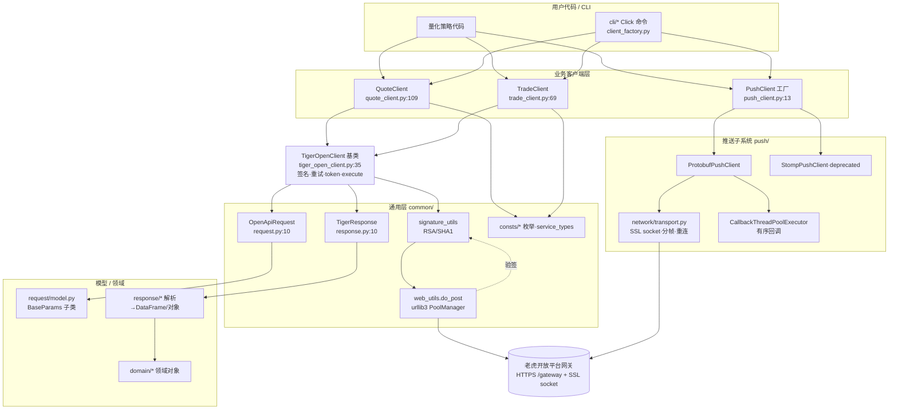
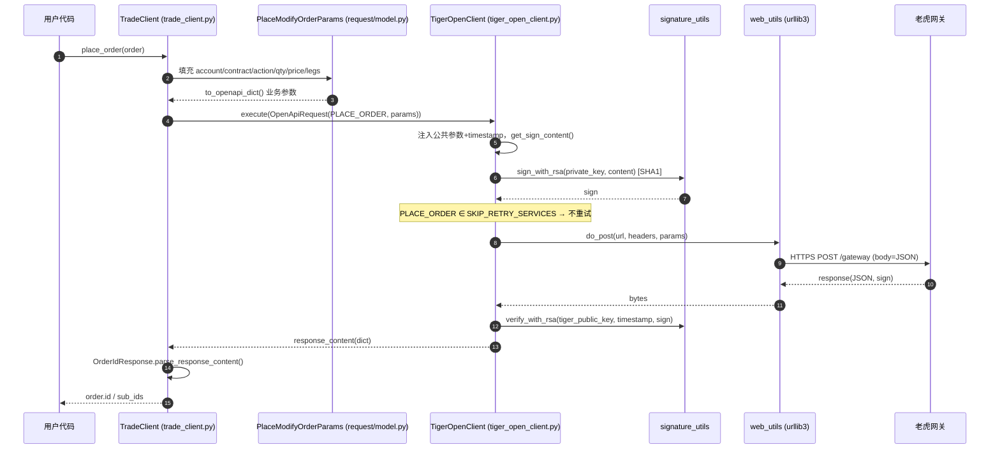
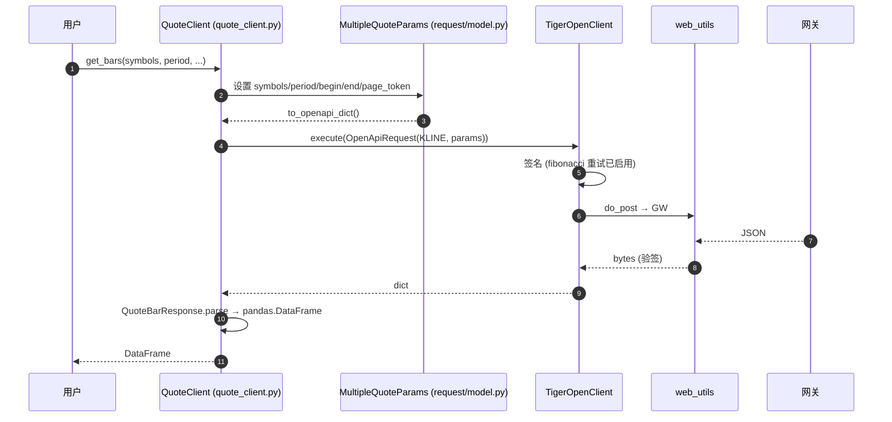
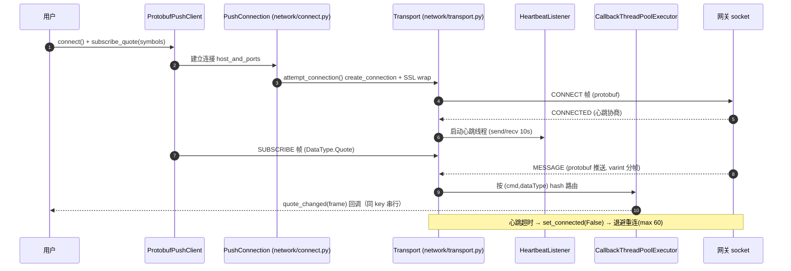

# 项目分析 — TigerBrokers Open API Python SDK (`tigeropen`)

**Date**: 2026-06-21
**Analyst**: Claude (nuclear-fusion / analyzing-codebase)
**Repo**: `/Users/fukai/Downloads/llm_project/git_target/github/openapi-python-sdk`
**Commit**: working tree @ `ddd0829`（master，版本 `3.5.9`）
**Coverage**: 深读核心层（`tiger_open_client.py`、`tiger_open_config.py`、`common/*`、`web_utils`、`signature_utils`）；通过 Explore 代理以 `file:line` 证据测绘 `quote/`、`trade/`、`push/`、`cli/`、`tests/`。**未逐行深读**：`fundamental/`（仅看目录与行数）、`examples/`（4224 LOC 示例代码，按示例对待）、`push/pb/*_pb2.py`（protobuf 生成代码）。
**Output language**: 中文

> 说明：本项目是**客户端 SDK**（封装对老虎证券开放平台网关的调用），不是服务端。因此 §6「API Surface」指的是 **SDK 对外暴露的 Python 方法面 + 与远端网关的线上协议契约**；§8「监控告警」在 SDK 语境下大部分为 `N/A`，已逐项标注。

---

## 1. Executive Summary

`tigeropen` 是老虎证券（TigerBrokers）官方的 **Open API Python SDK**，版本 3.5.9，Apache-2.0，约 **27.5k LOC**（含 examples）。它把老虎开放平台的「行情 / 交易 / 实时推送 / 基本面」四类能力封装成三个同步客户端（`QuoteClient`、`TradeClient`、`PushClient`）+ 一套 Click CLI（`tigeropen` 命令）。

- **架构风格**：分层库（layered library）——`配置层 → 基础客户端层（签名/重试/HTTP）→ 业务客户端层（quote/trade/push）→ 请求模型/响应解析/领域对象`。三大业务客户端均继承同一个 `TigerOpenClient` 基类（`tiger_open_client.py:35`）。
- **成熟度**：`Development Status :: 5 - Production/Stable`（`pyproject.toml:17`），有 ~7.8k LOC 测试、CHANGELOG 持续维护、CLI 与多环境（环球/US/sandbox）支持，工程化程度较高。
- **Top 风险**：① RSA 签名硬编码使用 **SHA1 + PKCS#1 v1.5**（`signature_utils.py:90,102`），而 `sign_type` 配置项形同虚设；② token 刷新依赖对 base64 token 的 **裸切片解析 `[:27]`**（`tiger_open_config.py:419-420`），格式假设脆弱。
- **Top 优点**：基础客户端与业务客户端职责清晰分层、签名/重试/token 自动刷新等横切关注点集中在基类一处实现；CLI 与核心库共用同一份客户端，测试覆盖面广。
- **规模**：6 个顶层包（cli/common/fundamental/push/quote/trade）+ examples；行情客户端 ~66 个公开方法、交易客户端 ~39 个、推送 14 类订阅；service method 常量 **100 个**（`service_types.py`）。

## 2. Tech Stack

### 2.1 核心运行时与构建

| Dimension | Technology | Version | Evidence |
|---|---|---|---|
| 语言 / 运行时 | Python | >=3.8（声明支持 3.8–3.14） | `pyproject.toml:11,23-29` |
| 构建后端 | setuptools + wheel | setuptools>=64 | `pyproject.toml:1-3` |
| 打包元数据 | PEP 621 `pyproject.toml`，`setup.py` 仅做兼容 shim | — | `setup.py:6-8` |
| 版本来源 | 动态读取 `tigeropen.__VERSION__` | 3.5.9 | `pyproject.toml:63-64`, `__init__.py` |
| 许可证 | Apache-2.0 | — | `pyproject.toml:10` |
| 安装器 | `install.sh` / `install.ps1` 脚本 | — | 根目录 |

### 2.2 网络 / 协议 / 安全

| Dimension | Technology | 用途 | Evidence |
|---|---|---|---|
| HTTP 客户端 | `urllib3.PoolManager`（全局单例） | 所有 REST 请求 | `common/util/web_utils.py:11,13` |
| 重试 | `backoff`（fibonacci 退避） | 请求级自动重试 | `tiger_open_client.py:13,165` |
| 加解密 / 签名 | `cryptography`（RSA, SHA1, PKCS1v15） | 请求签名 + 响应验签 | `signature_utils.py:88-103` |
| 备用加密依赖 | `rsa`、`pyasn1` | 声明依赖（核心路径走 cryptography） | `pyproject.toml:42-43` |
| 实时推送（新） | 自研 **Protobuf-over-SSL-socket** + `protobuf` | 默认推送通道 | `push/protobuf_push_client.py`, `push/pb/*` |
| 实时推送（旧） | `stomp.py`（STOMP 1.2 + JSON） | 已 deprecated | `push/stomp_push_client.py:120,130` |
| 设备指纹 | `getmac`（取 MAC 作为 device_id；失败回退 `uuid.getnode()`） | 风控/设备标识 | `tiger_open_config.py:77-83,309-322` |
| 配置文件解析 | `jproperties`（Java `.properties` 格式） | 读取 `tiger_openapi_config.properties` | `tiger_open_config.py:14,363-389` |

### 2.3 数据 / 工具 / CLI

| Dimension | Technology | 用途 | Evidence |
|---|---|---|---|
| 数据结构 | `pandas` | 行情响应转 DataFrame | `quote/response/*`（如 `quote_bar_response.py`） |
| 时间处理 | `python-dateutil`、`pytz`、`delorean` | 时区 / 时间戳换算 | `pyproject.toml:38-41`, `common_utils.py:get_tz_by_market` |
| JSON | `simplejson`（声明）+ 标准 `json`（实际签名/请求路径） | 序列化 | `request.py:29`, `signature_utils.py` |
| CLI 框架 | `click>=8.0` | `tigeropen` 命令入口 | `pyproject.toml:51`, `cli/main.py` |
| 文件监听（可选） | `watchdog`（软依赖，缺失则降级） | 多进程 token 文件变更监控 | `tiger_open_client.py:254-272` |
| 测试 | `unittest` + `unittest.mock` + Click `CliRunner` | 单测/CLI 集成测试 | `tests/*` |

> 无 `requirements.txt` 实质内容（仅 `.` 指向 pyproject，`requirements.txt:1-2`）。无 lockfile、无 CI 配置文件（`.github/` / `.gitlab-ci.yml` 均未见）——**(inferred)** CI 可能在仓库外维护。

## 3. Tech Stack Selection Analysis (vs mainstream alternatives)

### 3.1 选型对比矩阵

#### 选型 3.1.1 — HTTP 客户端：`urllib3.PoolManager`

| 维度 | 当前选型 urllib3 | 替代 A: requests | 替代 B: httpx | 替代 C: aiohttp |
|---|---|---|---|---|
| 名称 / 版本 | urllib3（全局单例 pool，`web_utils.py:13`） | requests | httpx | aiohttp |
| 核心优势（本项目场景）| 零额外封装、连接池开箱即用、依赖极轻；SDK 只需同步 POST/GET，足够 | 人体工学最佳、生态最广 | 同步+异步双栈、HTTP/2 | 高并发异步 IO |
| 核心劣势（本项目场景）| API 偏底层、需手动拼 body/headers/超时 | 比 urllib3 多一层依赖、本质仍是 urllib3 封装 | 引入较重依赖、SDK 无异步需求 | 强制 async，与当前同步阻塞模型不符 |
| 切换成本 | n/a | Low | Med | High |

**Inferred why**：SDK 调用是「请求-签名-POST-验签」的低频同步路径，无需异步/HTTP2；选 urllib3 把传递依赖压到最小（requests 也依赖 urllib3），适合一个要被各种量化环境 `pip install` 的库。

#### 选型 3.1.2 — 请求签名：`cryptography` 的 RSA + **SHA1 / PKCS1v15**

| 维度 | 当前选型 RSA-SHA1-PKCS1v15 | 替代 A: RSA-SHA256-PKCS1v15 | 替代 B: RSA-PSS-SHA256 | 替代 C: Ed25519 |
|---|---|---|---|---|
| 名称 | `hashes.SHA1()` + `padding.PKCS1v15()`（`signature_utils.py:90,102`）| SHA256 同填充 | PSS 填充 | 椭圆曲线签名 |
| 核心优势（本项目场景）| 与网关历史协议兼容、签名最短、CPU 开销低 | 抗碰撞强、行业默认 | 现代安全标准、抗选择消息攻击 | 密钥短、签名快、无填充歧义 |
| 核心劣势（本项目场景）| SHA1 已被学术界判定弱碰撞；与配置注释「推荐RSA2」不一致 | 需网关同步升级 | 网关需支持 PSS | 网关与历史密钥体系需大改 |
| 切换成本 | n/a | Med（需服务端协同）| High | High |

**Inferred why**：签名算法由**远端网关协议**决定，客户端必须匹配；SHA1 大概率是早期协议遗留。注意：`sign_type` 配置（默认 `'RSA'`，注释建议 `RSA2`）在实际签名路径里**未被读取**——签名算法被硬编码为 SHA1（详见风险 H1）。

#### 选型 3.1.3 — 实时推送：自研 Protobuf-over-SSL-socket（取代 STOMP）

| 维度 | 当前选型 自研 protobuf socket | 替代 A: stomp.py（旧实现，仍在）| 替代 B: websockets + JSON | 替代 C: gRPC streaming |
|---|---|---|---|---|
| 名称 | `protobuf_push_client.py` + `network/transport.py`（818 LOC 自研传输层）| `stomp.py` 1.2 文本协议 | `websockets` 库 | gRPC 双向流 |
| 核心优势（本项目场景）| 二进制紧凑、行情吞吐高、自带心跳/重连/有序回调线程池 | 协议成熟、实现简单、可读性好 | 标准 WS、浏览器友好 | 强类型、流控成熟 |
| 核心劣势（本项目场景）| 自研 818 LOC 传输层维护成本高、协议私有 | 文本协议体积大、已 deprecated（`stomp_push_client.py:120`）| 需自行实现心跳/重连/有序性 | 重依赖、与现网关协议不符 |
| 切换成本 | n/a | Low（已并存）| High | High |
| 默认值 | 心跳 `(10s,10s)`、`reconnect_attempts_max=60`（`protobuf_push_client.py:31,94`）| — | — | — |

**Inferred why**：行情推送对带宽和时延敏感，protobuf 二进制远优于 STOMP+JSON 文本；旧 STOMP 实现保留是为向后兼容。代价是把整套 socket 传输（心跳协商、varint 分帧、退避重连、有序回调）自己扛了下来。

#### 选型 3.1.4 — 行情响应载体：`pandas.DataFrame`

| 维度 | 当前选型 pandas | 替代 A: 纯 dict/list | 替代 B: dataclass/对象 | 替代 C: polars |
|---|---|---|---|---|
| 名称 | DataFrame（如 K 线/逐笔响应）| 原生结构 | 领域对象（trade 模块即如此）| polars |
| 核心优势（本项目场景）| 量化用户即取即用、可直接 `to_csv`/分析 | 零依赖、最轻 | 类型清晰、IDE 友好 | 大数据快、内存省 |
| 核心劣势（本项目场景）| pandas 是重依赖、import 慢、小数据开销大 | 用户需自行转换 | 不利批量数值运算 | 生态/受众小、再引入一重依赖 |
| 切换成本 | n/a | Med | Med | High |

**Inferred why**：目标用户是量化/数据分析开发者，行情天然是表格型，DataFrame 是该受众的「通用货币」；交易侧因强调单笔语义而改用领域对象（`trade/domain/*`），是合理的差异化。

#### 选型 3.1.5 — CLI 框架：`click`

| 维度 | 当前选型 click>=8 | 替代 A: argparse | 替代 B: typer | 替代 C: fire |
|---|---|---|---|---|
| 名称 | click（`cli/main.py` group 嵌套）| 标准库 argparse | typer（click 之上）| google fire |
| 核心优势（本项目场景）| 子命令组（quote/trade/account/push/config）嵌套清晰、装饰器式、`CliRunner` 易测 | 零依赖 | 类型注解驱动、更现代 | 极简、自动暴露对象 |
| 核心劣势（本项目场景）| 增加一重依赖 | 多级子命令样板代码多、难测 | 又引入 click 之上一层 | 不适合精细控制 |
| 切换成本 | n/a | Med | Low | High |

**Inferred why**：CLI 是「命令组 + 多级子命令 + 多格式输出（table/json/csv）」的典型形态，click 的 group/`CliRunner` 直接满足，且测试覆盖良好（`tests/cli/*` ~2.4k LOC）。

### 3.2 未单独对比的选型（one-line per item）
- `jproperties` — 读 Java `.properties` 配置，选型由「与其他语言 SDK 配置格式对齐」决定，无 architecture-shaping 替代讨论价值。
- `getmac` — 取设备 MAC，已自带 `uuid.getnode()` 回退，无关键替代。
- `backoff` — fibonacci 退避重试，可被 `tenacity` 替代但非关键路径。
- `pytz`/`python-dateutil`/`delorean` — 时间/时区工具，量化领域常规组合。
- `simplejson` — 声明依赖，但核心签名/请求路径实际使用标准 `json`，存在冗余可能。

## 4. Architecture & Module Breakdown

### 4.1 Style
**分层库（Layered Library）** —— 单进程、同步阻塞、按「基础设施 → 业务客户端 → 模型/领域」分层；推送子系统是其中一个独立的事件驱动子模块。

**Justification**：三大业务客户端 `QuoteClient`/`TradeClient` 都继承同一基类 `TigerOpenClient`（`quote/quote_client.py:109`、`trade/trade_client.py:69`），基类集中实现签名/重试/HTTP/token（`tiger_open_client.py:35,175`）；业务层只负责「构造请求模型 → `execute` → 解析响应」。

### 4.2 Top-level Architecture Diagram



### 4.3 Module Map

| Module / Package | Path | Purpose | LOC | Key entry `file:line` |
|---|---|---|---|---|
| 基础客户端 | `tigeropen/tiger_open_client.py` | 签名、fibonacci 重试、token 自动刷新、`execute` | 279 | `TigerOpenClient.execute` `:175` |
| 客户端配置 | `tigeropen/tiger_open_config.py` | 多源配置加载（参数>env>props）、动态域名、token 文件读写 | 575 | `TigerOpenClientConfig` `:86`；`get_client_config` `:521` |
| 行情 | `tigeropen/quote/` | ~66 个行情方法（股/期权/期货/基本面/筛选器） | 7276 | `QuoteClient` `quote_client.py:109` |
| 交易 | `tigeropen/trade/` | ~39 个交易方法（下单/改单/撤单/持仓/资产/行权/转移） | 6131 | `TradeClient` `trade_client.py:69` |
| 推送 | `tigeropen/push/` | 实时推送（protobuf 默认 / STOMP 旧）、SSL socket 传输、有序回调线程池 | 3969 | `PushClient` `push_client.py:13`；`transport.py:442` |
| 通用 | `tigeropen/common/` | 请求/响应/异常封装、签名、HTTP、常量枚举、工具函数 | 2824 | `request.py:10`、`response.py:10`、`consts/__init__.py` |
| 基本面 | `tigeropen/fundamental/` | 基本面请求模型与响应（财报/分红/拆股/行业） | 629 | `request/model.py`（未深读） |
| CLI | `tigeropen/cli/` | Click 命令行（quote/trade/account/push/config）+ 多格式输出 | 1556 | `cli/main.py:main`；`client_factory.py` |
| 示例 | `tigeropen/examples/` | 使用示例 + 期权辅助/AI 子目录 | 4224 | （示例，未深读） |

### 4.4 Dependency Sketch

```
cli/ ──▶ quote/、trade/、push/         （client_factory 懒加载并缓存）
quote/、trade/ ──▶ tiger_open_client（基类）──▶ common/（request/response/sign/web/consts）
quote/、trade/ ──▶ <module>/request/model（BaseParams 子类）
quote/、trade/ ──▶ <module>/response、<module>/domain
push/ ──▶ common/consts、push/pb、push/network、push/thread_pool
common/ ──▶（无上层依赖，叶子层）
```

**Cycles / inversions**：未观察到模块级循环依赖。注意 `tiger_open_client.py:27` 直接 `import TigerOpenClientConfig` 仅用于类型注解，属正常单向依赖。

### 4.5 Layering

| Layer | Backing directories | May depend on | May NOT depend on |
|---|---|---|---|
| 表现 / CLI | `cli/` | 业务客户端层、common | push/network 内部细节 |
| 业务客户端 | `quote/`、`trade/`、`push/` 顶层 | 基础客户端、common、各自 model/domain/response | cli |
| 基础客户端 | `tiger_open_client.py`、`tiger_open_config.py` | common | 任何业务客户端 |
| 通用 / 基础设施 | `common/`（util/consts/request/response/exceptions） | 第三方库 | 任何上层 |

### 4.6 Cross-cutting Concerns（概览，细节见 §6/§7/§9）
- **日志**：标准 `logging` + 线程本地 `THREAD_LOCAL`（`consts/__init__.py:18`）承载每请求 uuid/logger（`tiger_open_client.py:114,183`）。
- **追踪**：每请求生成 `uuid.uuid1()`（`tiger_open_client.py:183`），写入请求/响应 debug 日志，但无分布式 trace 透传。
- **配置**：三级优先级「参数 > 环境变量 `TIGEROPEN_*` > `.properties` 文件」（`tiger_open_config.py:540-550`）。
- **token 自动刷新**：后台 `RepeatTimer` 守护线程 + 可选 `watchdog` 多进程文件监控（`tiger_open_client.py:241-272`）。

## 5. Key Functional Flows

### Flow 5.1 — 下单（place_order）

- **Trigger**：`TradeClient.place_order(order)` at `trade/trade_client.py:919`
- **Sequence**：



- **End-to-end path**：`trade_client.py:919 place_order` → 构造 `PlaceModifyOrderParams`（`request/model.py:897`，`to_openapi_dict` `:1070`）→ `OpenApiRequest(PLACE_ORDER, params)`（`trade_client.py:979`）→ `TigerOpenClient.execute`（`tiger_open_client.py:175`）→ `__prepare_request` 签名（`:110`）→ `do_post`（`web_utils.py:16`）→ `__parse_response` 验签（`:134`）→ `OrderIdResponse`（`trade_client.py:982`）。
- **Data touched**：远端账户委托；本地仅回填 `order.id/sub_ids/orders`。
- **Side effects**：真实下单（外部副作用）；写 debug 日志。
- **Idempotency**：**非幂等**。`PLACE_ORDER/CANCEL_ORDER/MODIFY_ORDER` 被显式列入 `SKIP_RETRY_SERVICES`（`tiger_open_client.py:30`）以避免重试导致重复下单——无客户端去重/幂等键。
- **Latency budget**：未文档化；请求超时默认 15s（`tiger_open_config.py:63`）。

### Flow 5.2 — 行情查询（get_bars / 一般 quote 路径）

- **Trigger**：`QuoteClient.get_bars(...)` at `quote/quote_client.py:612`（其余 ~66 方法同构）
- **Sequence**：



- **End-to-end path**：`quote_client.py:612` → `MultipleQuoteParams`（`quote/request/model.py:230`）→ `OpenApiRequest(KLINE, ...)` → `execute`（`tiger_open_client.py:175`）→ `QuoteBarResponse`（`quote/response/quote_bar_response.py`，camelCase→snake_case + `pd.DataFrame`）。
- **Data touched**：仅远端只读行情。
- **Side effects**：无写副作用；可能触发初始化时的 `grab_quote_permission`（`QuoteClient.__init__`，`quote_client.py:111-128`）。
- **Idempotency**：天然幂等（只读 GET 语义，走 POST 传输）；启用 fibonacci 重试（`max_tries=5, max_time=60`，`tiger_open_config.py:131-132`）。
- **Latency budget**：未文档化。

### Flow 5.3 — 实时推送订阅（protobuf）

- **Trigger**：`PushClient.subscribe_quote(symbols)` → `ProtobufPushClient.subscribe_quote`（`push/protobuf_push_client.py:298`）
- **Sequence**：



- **End-to-end path**：`push_client.py:13`（工厂，`use_protobuf=True` 默认）→ `ProtobufPushClient`（`protobuf_push_client.py`）→ `PushConnection`（`network/connect.py:52`）→ `Transport.attempt_connection`（`transport.py:667`）→ 收帧 `notify`（`transport.py:199`）→ `CallbackThreadPoolExecutor.submit`（`thread_pool.py:20`）→ 用户回调。
- **Data touched**：内存订阅状态；无持久化。
- **Side effects**：长连接、心跳线程、回调线程池、自动重连。
- **Idempotency**：订阅幂等（重复 SUBSCRIBE 服务端去重）；回调按「首个参数 hash」路由到固定单线程 executor，保证**同 symbol/account 有序**（`thread_pool.py:32-37`）。
- **Latency budget**：心跳 `(10s,10s)`，接收超时含 1.5× 宽限（`listener.py`），重连退避指数 + 抖动，最多 60 次（`protobuf_push_client.py:94`）。

### Flow 5.4 — 初始化与动态域名 + token 自动刷新（prose）

`get_client_config()`（`tiger_open_config.py:521`）→ 构造 `TigerOpenClientConfig`：先 `_load_env_vars`（`:337`）再 `_load_props`（`:363`），`enable_dynamic_domain` 时 `query_domains()` 拉取 `https://cg.play-analytics.com`（1s 超时，`:480`）并按 license/服务类型选 trade/quote/socket 域名（`refresh_server_info` `:425`）。`TigerOpenClient._initialize`（`:66`）按需 `query_license`，若有 token+license 则启动 `RepeatTimer` 守护线程（`token_check_interval=300s`，`:245`）周期性 `should_token_refresh`（base64 解析 token 时间戳）→ `refresh_token`；可选 `watchdog` 监控 token 文件供多进程共享（`:250`）。

### Flow 5.5 — 撤单 / 改单（prose）

`cancel_order`（`trade_client.py:1063`，`CancelOrderParams` `model.py:1092`，service `CANCEL_ORDER`）与 `modify_order`（`:994`）同 place_order 走基类 `execute`，但同属 `SKIP_RETRY_SERVICES`，失败不自动重试以避免重复操作。

## 6. API Surface & Message Structures

> 本 SDK 不暴露 HTTP 路由；其「公共面」= ① Python 方法面（~66 quote + ~39 trade + 14 push 订阅 + CLI 命令）；② 与网关的**线上协议契约**（统一签名信封 + `service_types` 方法名）。

### 6.1 Surface Inventory（按类别，代表项）

| Category | 代表 Surface | Method | Handler `file:line` | Auth |
|---|---|---|---|---|
| 行情-股票 | `get_briefs`/`get_stock_briefs`/`get_bars`/`get_trade_ticks` | Python 调用 | `quote_client.py:272,346,612,775` | RSA 签名 + token |
| 行情-期权 | `get_option_chain`/`get_option_briefs`/`get_option_analysis` | — | `quote_client.py:963,1050,1429` | 同上 |
| 行情-期货 | `get_future_contracts`/`get_future_bars` | — | `quote_client.py:1553,1886` | 同上 |
| 行情-筛选 | `market_scanner` | — | `quote_client.py:2595` | 同上 |
| 行情-权限 | `grab_quote_permission`/`get_quote_permission` | — | `quote_client.py:2698,2717` | 同上 |
| 交易-下单 | `place_order`/`preview_order`/`modify_order`/`cancel_order` | — | `trade_client.py:919,861,994,1063` | 签名 + token（跳过重试） |
| 交易-查询 | `get_orders`/`get_positions`/`get_assets`/`get_prime_assets` | — | `trade_client.py:488,259,346,400` | 同上 |
| 交易-行权 | `submit_option_exercise`/`cancel_option_exercise` | — | `trade_client.py:1548,1722` | 同上 |
| 推送-订阅 | `subscribe_quote/tick/depth/option/future/kline/asset/position/order` | socket 帧 | `protobuf_push_client.py:298,308,318,...` | 长连接鉴权 |
| CLI | `tigeropen quote/trade/account/push/config ...` | shell | `cli/main.py`、`*_cmd.py` | 复用上述客户端 |

线上 service method 常量共 **100 个**（`common/consts/service_types.py`）。

### 6.2 Request 信封（统一契约，所有 REST 方法共用）

- **业务模型**：每个方法构造一个 `BaseParams` 子类（`common/model.py:7`），`to_openapi_dict()` 输出 camelCase 业务字段（仅含非 None）。
- **请求封装**：`OpenApiRequest.get_params()`（`request.py:23`）产出 `{method, version, biz_content=JSON(biz_model, sort_keys=True, separators=(',',':'))}`。
- **公共参数**（`tiger_open_client.py:84-98`）：`tiger_id`、`method`、`charset`、`version`（默认 `2.0`，`consts/__init__.py:15`）、`sign_type`、`timestamp`（`%Y-%m-%d %H:%M:%S`）、`device_id`、可选 `notify_url`。
- **签名**：对全部参数按 key 排序拼 `k=v&...`（`signature_utils.get_sign_content`），RSA-SHA1-PKCS1v15 签名后置入 `sign`（`tiger_open_client.py:121-126`）。
- **传输**：`do_post` 把 `params` 整体 `json.dumps` 作为 body，`urllib3` POST 到 `server_url`（`web_utils.py:28`）。Header 含 `Authorization=token`（`tiger_open_client.py:160-161`）。

### 6.3 Response 信封

- **结构**：`{code, message, data, sign, timestamp}`。`TigerResponse.parse_response_content`（`response.py:19-28`）取 `code/message/data`，`data` 为字符串时再 `json.loads`。
- **成功判定**：`is_success() == (code == 0)`（`response.py:16-17`）。
- **验签**：仅当配置了 `tiger_public_key` 且响应含 `sign` 且有 `timestamp` 时，对 `timestamp` 验签（`tiger_open_client.py:144-156`）。
- **解析为载体**：行情多转 `pandas.DataFrame`（`quote/response/*`）；交易转领域对象（`trade/domain/*`）。

### 6.4 Streaming 格式（推送）

- **Transport**：SSL socket 上的私有帧协议（protobuf）/ 旧 STOMP 1.2 文本。
- **Chunk shape**：varint 长度前缀 + protobuf `Response` 消息（`transport.py:56-83` encode/decode_frame）；`DataType` 枚举区分 Quote/Option/Future/QuoteDepth/TradeTick/Asset/Position/OrderStatus/Kline/Cc 等。
- **Terminator / ordering**：长度分帧自描述边界；回调按首参 hash 路由到单线程 executor，保证同 key 有序（`thread_pool.py:32-37`）。
- **Implementation** `file:line`：`push/network/transport.py:199-247`（notify/dispatch）。

### 6.5 Error Model

| Exception | Parent | 语义 | `file:line` |
|---|---|---|---|
| `ApiException(code, msg)` | `Exception` | 业务错误（带 code/msg）| `common/exceptions.py:9` |
| `RequestException` | `Exception` | 网络/请求构造失败 | `common/exceptions.py:20` |
| `ResponseException` | `Exception` | HTTP 非 200 / 验签失败 | `common/exceptions.py:24` |

**Wire envelope**：
```json
{ "code": 0, "message": "success", "data": { }, "sign": "...", "timestamp": "..." }
```
（构造点：服务端返回；客户端解析 `response.py:19-28`，验签 `tiger_open_client.py:144-156`）

**Retryability**：`RequestException`/`ResponseException` 触发 `backoff.on_exception(backoff.fibo, max_tries=5, max_time=60)` 重试（`tiger_open_client.py:163-173`）；但下单/改单/撤单（`SKIP_RETRY_SERVICES`）**不重试**。`ApiException`（业务 code≠0）由各业务方法在解析时抛出，不重试。

### 6.6 Custom Headers & Metadata Contract

| Header / 字段 | 方向 | 用途 | `file:line` |
|---|---|---|---|
| `Authorization` | request | 携带 token | `tiger_open_client.py:160-161` |
| `User-Agent` | request | `openapi-python-sdk-<ver>`，可前缀 channel（CLI 用 `tigercli`）| `tiger_open_client.py:55-62` |
| `sign` | req/resp | RSA 签名（请求体内字段，非 header）| `tiger_open_client.py:126` |
| `device_id` | request | MAC 设备指纹 | `tiger_open_config.py:309-322` |

### 6.7 Contract Docs

- **契约文档**：无仓内 OpenAPI/proto 契约（除推送 `pb/*_pb2.py` 生成代码）；官方文档外链 `https://docs.itigerup.com/docs/`（`pyproject.toml:56`）。
- **Generator**：推送 protobuf 由 `.proto` 生成（仓内仅见生成产物 `push/pb/*_pb2.py`，未见 `.proto` 源）。
- **Freshness**：REST 契约以服务端为准，SDK 手写跟随；`N/A` 自动校验。

## 7. Performance & Reliability Design

### 7.1 Concurrency Model
- REST 路径：**同步阻塞**，单线程调用 + 全局 `urllib3.PoolManager`（`web_utils.py:13`）。
- 后台线程：token 刷新 `RepeatTimer` 守护线程（`tiger_open_client.py:245,275-279`）；可选 watchdog 监控线程。
- 推送路径：1 个接收线程（`transport.py` receiver loop）+ 1 个心跳线程 + N 个回调单线程 executor。

### 7.2 HTTP / DB / Client Pooling

| Pool / cache | Class | Backend | Scope | TTL / size | `file:line` |
|---|---|---|---|---|---|
| HTTP 连接池 | `urllib3.PoolManager` | urllib3 | 模块级全局单例 | 默认 | `web_utils.py:13` |
| 私钥对象缓存 | `@lru_cache(maxsize=10)` | functools | 进程级 | 10 项 | `signature_utils.py:load_private_key` |
| 公钥对象缓存 | `@lru_cache(maxsize=10)` | functools | 进程级 | 10 项 | `signature_utils.py:load_public_key` |
| 回调线程池 | `CallbackThreadPoolExecutor` | N×单线程 ThreadPoolExecutor | 推送连接级 | `min(32, cpu+4)` | `thread_pool.py:14-19` |

**Lifecycle rules**：HTTP pool 进程内长存；推送 `disconnect()` 关闭回调 executor（`protobuf_push_client.py:110-113`）。

### 7.3 Caching Layers

| Layer | Backend | Use | TTL | `file:line` |
|---|---|---|---|---|
| In-memory | lru_cache | RSA 公私钥反序列化结果 | maxsize=10 | `signature_utils.py` |
| Distributed | — | `N/A`（SDK 无分布式缓存）| — | — |

### 7.4 Retry / Timeout / Cooldown / Circuit Breaker

| Mechanism | Default | Override | `file:line` |
|---|---|---|---|
| 重试算法 | `backoff.fibo`（fibonacci）| — | `tiger_open_client.py:165` |
| 最大重试次数 | `retry_max_tries=5` | `config.retry_max_tries` | `tiger_open_config.py:132` |
| 最大重试时间 | `retry_max_time=60s` | `config.retry_max_time` | `tiger_open_config.py:131` |
| 请求超时 | `TIMEOUT=15s` | `config.timeout` | `tiger_open_config.py:63` |
| 跳过重试服务 | place/cancel/modify order | 不可改 | `tiger_open_client.py:30` |
| 推送重连 | 指数退避+抖动，`reconnect_attempts_max=60` | — | `protobuf_push_client.py:94`、`transport.py:744-752` |
| 熔断 / fallback | 域名动态拉取失败→静默回退默认域名 | — | `tiger_open_config.py:487-509` |

### 7.5 Rate Limiting
- **客户端侧无限流**（`N/A`）。限流由服务端实施；SDK 仅提供 `get_kline_quota`（`quote_client.py:3103`）查询配额。

### 7.6 Batching / Queueing / Back-pressure
- REST 无批处理/队列。
- 推送：接收线程 → 回调线程池，无显式背压（executor 队列无界）——见风险 M2。
- 行情查询支持分页（`begin_index`/`end_index`/`page_token`，`quote/request/model.py:230`）以控制单次返回量。

### 7.7 DB Performance Constraints
- `N/A` —— SDK 不直接访问数据库。

### 7.8 Cold Start / Startup Optimization
- CLI `push` 命令对 protobuf/推送依赖做**懒加载**（避免非推送用户付出 import 成本）。
- 私钥/公钥解析 `lru_cache` 避免重复反序列化。
- `query_domains` 用 1s 短超时（`tiger_open_config.py:480`）以免初始化长阻塞。

### 7.9 Stated Baselines
- 仓内**无** RPS / 时延 / 吞吐基准（README grep 无命中）。唯一硬数字：请求超时 15s、重试 5 次/60s、心跳 10s、重连 60 次。

## 8. Monitoring, Alerting & Audit

> SDK 语境：除日志外大部分为 `N/A`（监控/告警由调用方与服务端负责）。

### 8.1 Metrics Inventory
- `N/A` —— 无 Prometheus/StatsD 等指标埋点。可观测性仅靠日志。

### 8.2 Tracing
- 无分布式追踪框架。每请求 `uuid.uuid1()` 写入 `THREAD_LOCAL.uuid`（`tiger_open_client.py:183`），并打进请求/响应 debug 日志，作为**单机关联 ID**。

### 8.3 Audit
- 无审计存储。token 写回 `.properties` 文件（`store_token`，`tiger_open_config.py:404-415`）；`refresh_token` 记录 old/new token 到日志（`tiger_open_client.py:231`）——见风险 M3（token 落日志）。

### 8.4 Alerting
- `N/A` —— 无告警枚举/通道。失败仅记 error 日志（如 `query_license`/`refresh_token` 失败，`tiger_open_client.py:209,224`）。

### 8.5 Telemetry Retention

| Signal | Retention | Source of value |
|---|---|---|
| Logs | 由调用方 `log_path` 决定（`tiger_open_config.py:129`），SDK 不轮转 | 配置 |
| Metrics | `N/A` | — |
| Traces | `N/A`（仅每请求 uuid）| — |

## 9. Key Tech & Cross-cutting Patterns

- **基类模板方法**：`TigerOpenClient` 把「签名→重试→POST→验签→解析」固化在 `execute`，业务子类只填模型（`tiger_open_client.py:175`）。
- **请求模型 `to_openapi_dict` 约定**：`BaseParams` 子类统一用「私有属性 + property + 仅序列化非 None 字段 + snake↔camel 转换」（`common/model.py`、`common/util/string_utils.py`）。
- **工厂 + 懒加载客户端（CLI）**：`client_factory.py` 缓存 quote/trade client，`channel='tigercli'`。
- **推送工厂 + 双实现**：`PushClient(use_protobuf=...)` 在 protobuf（默认）与 STOMP（deprecated）间切换（`push_client.py:13-31`）。
- **有序回调线程池**：按首参 hash 路由到固定单线程，保证同 symbol/account 串行（`thread_pool.py`）——量化推送场景的关键正确性保证。
- **多源配置 + 环境变量前缀**：`TIGEROPEN_*` 优先级链（`tiger_open_config.py:337-389`）。
- **领域工具**：`order_utils`（market/limit/stop/trailing/algo/multi_leg 订单工厂）、`contract_utils`（股/期权/期货/基金/CC 合约工厂 + 期权标识符解析）、`price_util`（tick size 校验与价格对齐）。
- **跨切关注**：i18n 通过 `Language`/`lang` 字段；无 feature flag；多租户边界 = `account`/`license`（环球/US/sandbox 域名隔离）。

## 10. Risks & Issues

### 10.1 Critical
*(无)* —— 未发现仓内明文私钥/密钥外泄、远程代码执行、反序列化漏洞等致命问题（老虎**公钥**硬编码属正常，`tiger_open_config.py:53-55`）。

### 10.2 High

| ID | Issue | Evidence | Impact | Remediation Direction |
|---|---|---|---|---|
| H1 | 签名算法硬编码 **SHA1**，`sign_type` 配置不生效 | `signature_utils.py:90,102`；`tiger_open_config.py:103-104,201-206` | SHA1 抗碰撞弱；且配置注释「推荐RSA2」误导用户以为可切换，实际签名路径从不读取 `sign_type` | 与网关协同支持 SHA256，按 `sign_type` 分派算法；或在文档/注释中明确当前固定 SHA1，移除误导 |
| H2 | token 时间戳**裸切片解析** `[:27]` | `tiger_open_config.py:419-420`（`base64.b64decode(token)[:27].decode().split(',')`）| token 编码格式若变更，`should_token_refresh` 直接抛异常，刷新线程静默失效 | 改为结构化解析 + try/except 容错，解析失败时按「需刷新」或显式告警处理 |
| H3 | 全局可变调度状态 `_SCHEDULE_STATE` | `tiger_open_client.py:32,242-243` | 模块级全局 dict 控制刷新线程是否启动；多个 client 实例/多账户场景下，**只有第一个**会启动 token 刷新线程，其余被静默跳过 | 将调度状态下沉到实例或以 (tiger_id, account) 为键管理，支持多账户并发 |

### 10.3 Medium

| ID | Issue | Evidence | Impact | Remediation Direction |
|---|---|---|---|---|
| M1 | 文件句柄未用上下文管理器 | `signature_utils.py:read_private_key`（`open(key_file,'r').read()` 不关闭） | 句柄泄漏（小，进程级少量）；异常时不释放 | 改 `with open(...) as f` |
| M2 | 回调线程池队列**无界** | `thread_pool.py`（N×`ThreadPoolExecutor(max_workers=1)`，无 maxsize 背压） | 推送风暴时回调慢于到达速率会导致内存堆积 | 引入有界队列/丢弃策略/滞后监控回调 |
| M3 | token 明文进入日志 | `tiger_open_client.py:231`（`refresh token, old:{token}, new:{new}`） | 日志若被收集/共享，token 泄漏 | 对 token 脱敏（仅记前后若干位） |
| M4 | `query_domains`/`query_license` 异常被**静默吞掉** | `tiger_open_config.py:487-488`；`tiger_open_client.py:202-203` | 动态域名/license 失败时无显式信号，回退到默认域名，问题难定位 | 至少记 warning 日志，区分「网络失败」与「无配置」 |
| M5 | `simplejson` 声明依赖但核心路径用标准 `json` | `pyproject.toml:37`；`request.py:7`、`signature_utils.py` | 依赖冗余、潜在序列化行为不一致 | 统一 JSON 库或移除冗余依赖 |

### 10.4 Low / Info
- `quote/quote_client.py` 单文件 **3266 LOC**、`trade/request/model.py` **2162 LOC**——god file 倾向，建议按子域拆分（`quote_client.py:109`）。
- 无仓内 CI 配置（`.github/`/`.gitlab-ci.yml` 缺失），发布/测试流程不可见。
- `RepeatTimer` 子类覆盖 `run` 实现周期定时（`tiger_open_client.py:275-279`），可读但非标准 `sched`/`asyncio`。
- STOMP 实现保留但已 deprecated（`stomp_push_client.py:120`），属可计划移除的死/旧代码。
- `_load_props` 整体 `try/except` 后仅 `logging.error`，配置部分失败会被吞（`tiger_open_config.py:387-388`）。

## 11. Strengths

- **横切关注集中**：签名/重试/token/HTTP/验签全部收敛在 `TigerOpenClient` 一处（`tiger_open_client.py:175`），业务客户端极薄，易扩展新 API。
- **分层清晰、依赖单向**：cli→client→common 无循环依赖；请求模型/响应解析/领域对象职责分离。
- **推送有序性保证**：按首参 hash 的单线程路由（`thread_pool.py:32-37`）从设计上解决了「同标的乱序回调」这一量化场景的关键正确性问题。
- **配置体验好**：参数>env>props 三级优先级 + 动态域名 + 多环境（环球/US/sandbox），覆盖真实部署形态（`tiger_open_config.py`）。
- **测试覆盖广**：~7.8k LOC 测试，含 quote/trade/push/cli 的 mock 与 `CliRunner` 集成测试（`tests/`）。

## 12. Open Questions

- `sign_type` 配置是否**有意**保留为占位（等待网关支持 SHA256），还是历史遗漏？这决定 H1 是「文档修正」还是「功能补全」。
- 多账户/多 client 实例是否是受支持的使用场景？若是，H3 的全局调度状态需重构。
- 推送 `.proto` 源文件是否在另一个仓库维护？仓内仅有生成产物，影响协议演进可追溯性。
- CI/发布流程在何处？仓内无 CI 配置，需确认测试是否在 PR 上强制执行。
- `examples/ai`、`examples/option_helpers` 是否随版本同步维护，还是仅演示用途？

## 13. Suggested Next Steps

- [ ] （handoff to `reviewing-code`）针对 §10 的 **H1（SHA1 签名）/ H2（token 解析）/ H3（全局调度状态）** 做一次聚焦代码评审，确认是否为已知约束并定级。
- [ ] （handoff to `quick-coding`）M1（`with open`）、M3（token 日志脱敏）、M5（移除冗余 `simplejson` 或统一 JSON）——均为 ≤3 文件低风险修复。
- [ ] （handoff to `designing-solution`）若确认需支持多账户并发，为 token 刷新调度设计「按 (tiger_id, account) 维度的实例级调度」方案，替换 `_SCHEDULE_STATE` 全局状态。
- [ ] （handoff to `expert-consulting`）评估推送回调线程池的背压策略（有界队列 vs 丢弃 vs 监控），权衡内存安全与回调完整性（M2）。
- [ ] （handoff to `quick-coding`）评估拆分 `quote_client.py`（3266 LOC）为「股票/期权/期货/基本面/筛选」子客户端的可行性与兼容性影响。

---

**Scope honesty**：深读了核心客户端、配置、common 全层、签名/HTTP；`quote/`、`trade/`、`push/`、`cli/`、`tests/` 通过 Explore 代理以 `file:line` 证据测绘但未逐行复核每个方法。**未深读**：`fundamental/`（仅目录与行数）、`examples/`（4224 LOC，按示例对待）、`push/pb/*_pb2.py`（protobuf 生成代码）。本报告不修改任何源码。
